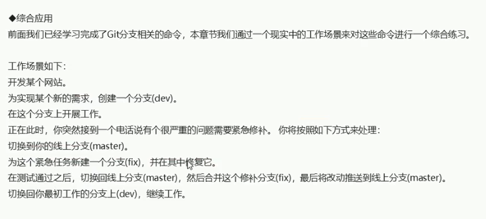

常用远程托管平台[GigHub](https://github.com/) | [码云](https://gitee.com/) | [GitLab](https://about.gitlab.com/)

## 配置
### 用户配置

```shell
git config --global user.name "xxx"
git config --global user.email "xxx@qq.com"

git config --[local/global/system] obj.键 + 空格 + 值 //修改、添加配置
git config --[local/global/system] --unset obj.键  //删除配置

查看
git config --list
git config user.name

git 配置分为三部分
    1、本地配置位于本地仓库的隐藏文件夹.git/config 文件  默认以core开头
       git config --local --list (只 本地配置)

    2、全局配置位于用户的根目录下 .gitconfig  //需要进行过全局配置才会有该文件
       git config --global --list (只 全局配置)

    3、系统配置位于git的安装目录下
       git config --system --list (只 系统配置)

    (优先级依次降低 如果三个配置文件中都有同样的配置优先以本地为准)
```
> 操作完成之后信息保存在**C盘的用户**下**.gitconfig**文件中，作用只是标识你是谁,与远程仓库账户无关


### 获取仓库
```shell
git init #生成隐藏文件夹.git 
或
git clone 项目地址 
```

### 工作区间
> 工作区：包含.git版本库的目录  
> 暂存区：.git版本库下的index文件就是暂存区(stage),是一个临时保存修改文件的地方  
> 版本库：项目文件夹下.git隐藏文件夹就是版本库,储存这项目配置信息、日志信息、文件版本等    
> 远程仓库：

工作区 git add . 到暂存区 commit 版本库  push 远程仓库
### 文件状态
```shell
untracked : # 未跟踪(未被纳入版本控制)
tracked   : # 以跟踪(纳入版本控制)
    Unmodified # 未修改
    Modified   # 已修改
    Staged     # 已暂存

git status # 指令查看文件状态
```
### 从本地到远程仓库流程
```shell
mkdir project
cd project
git init
touch README.md
git add README.md
git commit -m "first commit"
git remote add origin https://gitee.com/liaozhongxun/project.git
git push -u origin master
```


## 指令
### 常用指令
```shell
git status [-s]# 查看文件状态
git add file|. # 将文件添加到暂存区
git reset file # 取消暂存，变为之前的状态
git commit -m '日志信息' # 将暂存区文件提交到版本库(状态变为已跟踪未修改 看不到了)
git commit -a -m '日志信息' # 不用add 直接添加到版本库
git commit 回车(进入编辑器) --> i(进入编辑模式) --> esc (退出编辑模式) --> :wq(保存并退出)
git log # 查看日志记录
	commit id  重要
```
### 撤销
```shell
git reset file # 取消暂存，变为之前的状态
git reset --hard  commit_id # --hard – 强制将缓存区和工作目录都同步到你指定的提交
git revert commit_id
```
### 远程仓库
```shell
git remote [-v]# 查看远程仓库 
git remote show origin # 查看远程仓库名为origin的详细信息
git remote add <name> <url> # 添加远程仓库name建议用origin,一个项目可以添加到多个远程仓库
							# <name>为本地自定义远程仓库别名，clone项目默认都是origin
git remote rm <name> # 端口与指定名称的远程仓库的关联
git push <name> <branch> # 提交到远程,如果后期不需要跟换仓库名与分支可以直接git push

git clone <url> # 从远程克隆项目
git pull # 从远程拉去最新内容，与fetch的差别pull会自动合并
         # 第一次链接远程且本地有文件，pull时不允许合并添加 --allow-unrelated-histories强行合并
git fetch # 从远程拉去最新内容
    git merge origin/master # 手动指定仓库名/分支合并到工作区
```

### 分支
> 分支分为本地放在(本地操作是后面跟的那个如 master)和远程分支(远程tags旁边那个如 origin/master)

```shell
git branch # 查看所有本地分支
git branch -r # 查看所有远程分支
git branch -a # 查看本地与远程的分支（远程分支前面会有remotes表示这是远程的）

git branch <branch name> # 创建本地分支
git checkout <branch name> # 切换分支
git checkout -b <branch name> # 创建并切换
git push origin <branch name> # 将本地分支推送到远程

git merge <branch name> # 将指定分支版本库内容合并到当前分支
                        # 如果两个分支多同一个文件同一部分进行不同修改，会产生冲突
                        # 解决方法打开文件去除不要的在提交上去就行了

git branch -d <branch name> # 删除本地分支(要在其他分支上操作，并且新增内容要提交到远程才能成功)
git branch -D <branch name> # 删除本地分支(要在其他分支上操作，并且新增内容可以不用提交,D就是强行删除)
git push origin -d <branch name> # 删除远程分支
```
分支的运用案例


### 标签
> 记录特定事件点的状态

```shell
git tag <tag name> # 创建标签
git show <tag name> # 查看标签
git push origin <tag name> # 将指定标签推送到远程
git checkout -b <branch name> <tag name> # 检出指定分支 指定标签的代码

git tag -d <tag name> # 删除标签
git push origin :refs/tags/<tag name> # 删除远程标签
```

### 文件操作
```shell
git rm file # 删除工作区文件(要通过commit提交到版本库才会删除仓库中的文件)
touch .gitignore # 创建文件
```
## 忽略文件 .gitignore
```shell
*.txt  # 忽略所有.txt格式文件
!list.txt # 不需要忽略指定文件
/filename # 忽略指定文件名
build/    # 忽略指定文件夹
doc/*.txt # 忽略doc文件夹下的.txt文件
doc/**/*.txt # 忽略doc下所有.txt文件

```
## GIT协议
git支持一下四种协议
+ 本地协议(Local)
+ HTTPS 协议
+ SSH 协议
+ GiT协议

> GitHub与码云目前常用HTTPS与SSH协议,平时大多使用HTTPS协议

```shell
git clone https://github.com/liaozhongxun/xxx.git
```

### SSH
> SSH (Secure Shell 安全外壳协议) 的缩写 可以不要每次输入用户名密码，而是利用公钥和私钥进行比对

1、git下输入  ssh-keygen|ssh-keygen -t rsa  连续回车生成公私钥（公私钥与本台计算机有关）

2、公私钥匙用户家目录下的 .ssh 文件夹中
   私钥 : id_rsa 
   公钥 : id_rsa.pub

3、复制公钥的内容到远程仓库(GitHub 或 开源中国等）
   添加成功后本台计算机就能和远程仓库进行ssh交互了

[参考资料 后续继续](https://www.bilibili.com/video/BV1yz4y1y7RQ?p=40)
